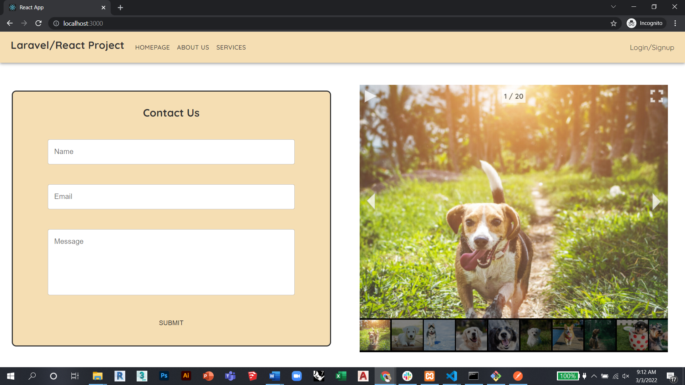

# laravel-react-project

### Hi there, I'm Mohammad Moussalli 👋

## I'm a Civil Engineer and a future Developer!

### Connect with me:

[][linkedin]

 
 

[linkedin]: https://www.linkedin.com/in/mohamadmoussalli/

---

---

---

#### This is an Educational Project implemented using Laravel Framework and React Js Library undergone using the MVC (Model-View-Controller) software design architecural pattern.
#### For the Backend,PHP language was used in a Laravel Framework to implement the APIs and connect to the Database.
#### The Backend represents the Model and Controller parts of this Educational Project .
#### For the Frontend, JSX language was used in a React Js Library to connect with the Backend and display the returned output from the Model to the user.
#### The Frontend represents the View part of this Educational Project .

##### The Project consists of a Landing page, an About Us page, a Services page and a Login/Register page. Once the user login or register, he/she can have access to a Dashboard page,
##### where he/she can update his details.

##### You can find demo pictures of the website below.

